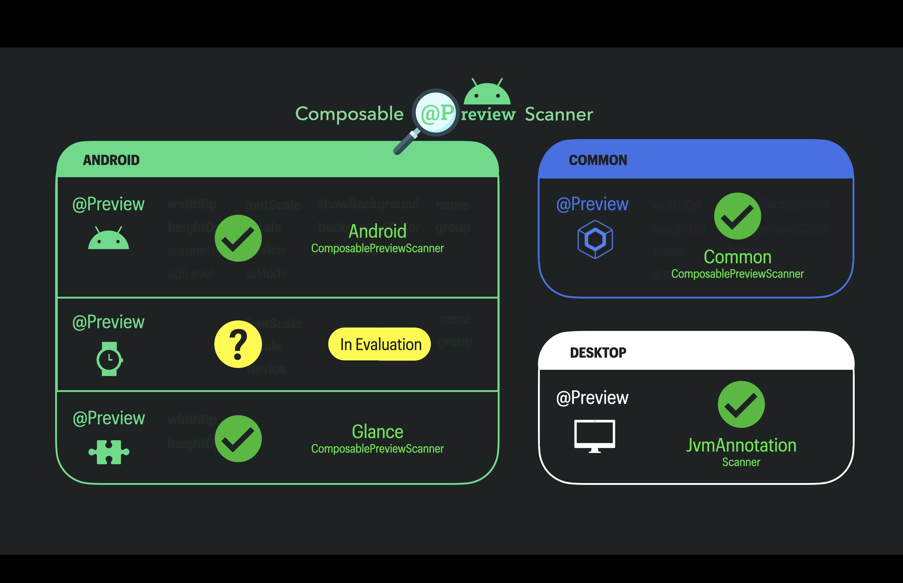

[](https://jitpack.io/#sergio-sastre/ComposablePreviewScanner)
[](https://central.sonatype.com/artifact/io.github.sergio-sastre.ComposablePreviewScanner/android)</br>

<a href="https://androidweekly.net/issues/issue-628">

</a></br>
<a href="https://jetc.dev/issues/221.html"></a>

# <p align="center">Composable Preview Scanner</p>


<p align="center">

</p>

A library to help auto-generate screenshot tests from Composable Previews (e.g. **Android**, **Glance** & **Compose Multiplatform**) with any screenshot testing library:
JVM-based (i.e. Paparazzi, Roborazzi) as well as Instrumentation-based (i.e. Shot, Dropshots, Android-Testify, etc.)


> [!NOTE]
> Support for Wear OS Tile `@Previews` is under evaluation

#### Provide anonymous feedback
Already using ComposablePreviewScanner?</br>
I'd love to hear your thoughts!</br>
Help shape its future by taking [this quick survey](https://forms.gle/jcvggBxv14CLqjFo6)

---

## 📋 Table of Contents

- [Quick Start](#-quick-start)
- [Common Use Cases](#-common-use-cases)
- [Comparison with Other Solutions](#comparison-with-other-solutions)
- [Installation](#-installation)
- [How to Use](#how-to-use)
  - [API Overview](#api)
  - [Scanning](#scanning)
  - [JVM Screenshot Tests](#jvm-screenshot-tests)
    - [Paparazzi](docs/paparazzi-guide.md)
    - [Roborazzi](docs/roborazzi-guide.md)
  - [Instrumentation Screenshot Tests](docs/instrumentation-guide.md)
  - [Glance Previews Support](docs/glance-previews.md)
  - [Compose Multiplatform Previews Support](docs/multiplatform.md)
- [Advanced Usage](docs/advanced-usage.md)
- [How It Works](#how-it-works)
- [Resources](#resources)
- [Testing](#testing)
- [Troubleshooting](docs/troubleshooting.md)

---

## 🚀 Quick Start

**TL;DR:** ComposablePreviewScanner automatically generates screenshot tests from your existing `@Preview` composables.

1. **Add dependency** (choose your preview type):
   ```kotlin
   testImplementation("io.github.sergio-sastre.ComposablePreviewScanner:android:<version>")
   ```

2. **Scan your previews**:
   ```kotlin
   val previews = AndroidComposablePreviewScanner()
       .scanPackageTrees("your.package")
       .getPreviews()
   ```

3. **Generate screenshot tests** (example with Paparazzi):
   ```kotlin
   @RunWith(Parameterized::class)
   class PreviewScreenshotTests(val preview: ComposablePreview<AndroidPreviewInfo>) {
       @get:Rule val paparazzi = Paparazzi()
       
       @Test
       fun snapshot() {
           paparazzi.snapshot { preview() }
       }
       
       companion object {
           @JvmStatic
           @Parameterized.Parameters
           fun previews() = AndroidComposablePreviewScanner()
               .scanPackageTrees("your.package")
               .getPreviews()
       }
   }
   ```

📖 **[See detailed setup guides →](docs/)**

---

## 🎯 Common Use Cases

| I want to... | Go to |
|-------------|-------|
| Generate Paparazzi tests from Android Previews | [Paparazzi Guide](docs/paparazzi-guide.md) |
| Generate Roborazzi tests from Android Previews | [Roborazzi Guide](docs/roborazzi-guide.md) |
| Use with instrumentation tests (Shot, Dropshots, Testify) | [Instrumentation Guide](docs/instrumentation-guide.md) |
| Scan Glance widget previews | [Glance Support](docs/glance-previews.md) |
| Support Compose Multiplatform | [Multiplatform Guide](docs/multiplatform.md) |
| Customize screenshot file names | [Advanced Usage](docs/advanced-usage.md#screenshot-file-names) |
| Parse Preview device strings | [Advanced Usage](docs/advanced-usage.md#parsing-preview-device-string-android-previews) |
| Fix common errors | [Troubleshooting](docs/troubleshooting.md) |

---

# Comparison with other solutions
|                                                      | Composable Preview Scanner                                             | Showkase                                                        | Compose Preview Screenshot Testing            |
|------------------------------------------------------|------------------------------------------------------------------------|-----------------------------------------------------------------|-----------------------------------------------|
| Independent of AGP version                           | ✅                                                                      | ✅                                                               | ❌                                             |
| Library-agnostic solution                            | ✅                                                                      | ✅                                                               | ❌<sup>1</sup>                                 |
| Scans previews in different sources sets<sup>2</sup> | ✅ main<br/>✅ screenshotTest<br/>✅ androidTest                          | ✅ main<br/>❌ screenshotTest<br/>❌ androidTest                   | ❌ main<br/>✅ screenshotTest<br/>❌ androidTest |
| Preview Infos available                              | ✅                                                                      | ❌<sup>3</sup>                                                   | ✅                                             |
| Specific Config (e.g. for Libs) available            | ✅<sup>4</sup>                                                          | ❌                                                               | ⚠️<sup>5</sup>                                |
| Supported Preview types                              | ✅ Android</br> ✅ Glance</br> ✅ Compose Multiplatform <sup>6</sup></br> | ✅ Android</br> ❌Glance</br> ❌Compose Multiplatform <sup>7</sup> | ✅ Android</br> ❌ Glance</br> ❌ Compose Multiplatform               |

<sup>1</sup> Compose Preview Screenshot Testing is a standalone solution based on LayoutLib, whereas ComposablePreviewScanner and Showkase provide Composables' infos so you can run screenshot tests with your favourite screenshot testing library.</br></br>
<sup>2</sup> From version 0.5.0, ComposablePreviewScanner can scan previews in any source set. Compose Preview Screenshot Testing requires to put the previews in a brand-new "screenshotTest" source.</br></br>
<sup>3</sup> Showkase components only hold information about the Composable, but not about the Preview Info (i.e. ApiLevel, Locale, UiMode, FontScale...).</br></br>
<sup>4</sup> ComposablePreviewScanner supports adding extra lib-config (e.g. Paparazzi's Rendering Mode or Roborazzi's compare options) in the form of annotations that are additionally added to the preview. You can check how in the examples below in [Jvm Screenshot Tests](#jvm-screenshot-tests) and [Instrumentation Screenshot Tests](#instrumentation-screenshot-tests) respectively.</br></br>
<sup>5</sup> Compose Preview Screenshot Testing supports *only general tolerance* via gradle plugin from version [0.0.1-alpha06](https://developer.android.com/studio/preview/compose-screenshot-testing#001-alpha06)</br></br>
<sup>6</sup> Compose Multiplatform Previews for Desktop are supported with a workaround</br></br>
<sup>7</sup> [Showkase: Compose Multiplatform Support](https://github.com/airbnb/Showkase/issues/364)
</br></br></br>
ComposablePreviewScanner also works with:
- `@PreviewParameters` (for Compose Multiplatform since 0.6.0+)
- Multi-Previews, including  `@PreviewScreenSizes`, `@PreviewFontScales`, `@PreviewLightDark`, and `@PreviewDynamicColors` as well as custom multi-previews.
- private `@Previews` (from version 0.1.3+)
- `@Previews` inside public classes<sup>1</sup> (from version 0.3.0+), not nested classes though
- `@Previews` located in any source set, like "main", "screenshotTest" and "androidTest" (from version 0.5.0+)
- `@Previews` with default-parameters (from version 0.5.1+)

<sup>1</sup> The [Compose Preview Screenshot Testing tool](https://developer.android.com/studio/preview/compose-screenshot-testing) from Google requires you to put your `@Previews` inside a class.

# 📦 Installation

> [!WARNING]  
> Beware the prefixes:</br>
> *Maven Central* -> **io.github**</br>
> *JitPack* -> **com.github**</br>

## Maven Central (Recommended)
```kotlin
// all of them are supported in jvm-targets only
dependencies {
   // android previews
   testImplementation("io.github.sergio-sastre.ComposablePreviewScanner:android:<version>")

   // glance previews (since 0.7.0+)
   testImplementation("io.github.sergio-sastre.ComposablePreviewScanner:glance:<version>")

   // common previews (compose multiplatform)
   testImplementation("io.github.sergio-sastre.ComposablePreviewScanner:common:<version>")

   // define annotation to scan. Use this for desktop previews (compose multiplatform)
   testImplementation("io.github.sergio-sastre.ComposablePreviewScanner:jvm:<version>")
}
```

## JitPack
Add JitPack to your root build.gradle file:
```kotlin
allprojects {
   repositories {
      maven { url 'https://jitpack.io' }
   }
}
```

```kotlin
dependencies {
   // android previews
   testImplementation("com.github.sergio-sastre.ComposablePreviewScanner:android:<version>")

   // glance previews (since 0.7.0+)
   testImplementation("com.github.sergio-sastre.ComposablePreviewScanner:glance:<version>")

   // common previews (compose multiplatform)
   testImplementation("com.github.sergio-sastre.ComposablePreviewScanner:common:<version>")

   // define annotation to scan. Use this for desktop previews (compose multiplatform)
   testImplementation("com.github.sergio-sastre.ComposablePreviewScanner:jvm:<version>")
}
```

# How to use
## Android Previews
### Screenshot Testing Libraries
1. [Jvm Screenshot Tests](#jvm-screenshot-tests)</br>
   1.1  [Paparazzi](#paparazzi)</br>
   1.2  [Roborazzi](#roborazzi)</br>
2. [Instrumentation Screenshot Tests](#instrumentation-screenshot-tests)

If you encounter any issues when executing the screenshot tests, take a look at the [Troubleshooting](#troubleshooting) section.

> [!NOTE]
> [Roborazzi](https://github.com/takahirom/roborazzi) has integrated ComposablePreviewScanner in its plugin since [version 1.22](https://github.com/takahirom/roborazzi/releases/tag/1.22.0)

## Non-Android Previews
1. [Glance Previews Support](#glance-previews-support)
2. [Compose Multiplatform Previews Support](#compose-multiplatform-previews-support)

## API   
`AndroidComposablePreviewScanner`, `GlanceComposablePreviewScanner`, `CommonComposablePreviewScanner`, and `JvmAnnotationScanner` have the same API.
The API is pretty simple:

```kotlin
AndroidComposablePreviewScanner()
    // Optional to log scanning info like scanning time or amount of previews found
    .enableScanningLogs()
    // Optional to scan previews in compiled classes of other source sets, like "screenshotTest" or "androidTest"
    // If omitted, it scans previews in 'main' at build time
    .setTargetSourceSet(
       Classpath(SourceSet.SCREENSHOT_TEST) // scan previews under "screenshotTest"
    )
    // Required: define where to scan for Previews.
    // See 'Scanning Source Options (packages, files, inputStreams)'
    .scanPackageTrees(
        include = listOf("your.package", "your.package2"),
        exclude = listOf("your.package.subpackage1", "your.package2.subpackage1")
    )
    // Optional to filter out scanned previews with any of the given annotations
    // Warning: this and its 'include' counterpart are mutually exclusive by API design
    .excludeIfAnnotatedWithAnyOf(
        ExcludeForScreenshot::class.java, 
        ExcludeForScreenshot2::class.java
    )
    // Optional to filter in only scanned previews with any of the given annotations
    // Warning: this and its 'exclude' counterpart are mutually exclusive by API design
    .includeIfAnnotatedWithAnyOf(
        IncludeForScreenshot::class.java,
        IncludeForScreenshot2::class.java
    )
    // Optional to include configuration info of the screenshot testing library in use
    // See 'How to use -> Libraries' above for further info
    .includeAnnotationInfoForAllOf(
        ScreenshotConfig::class.java,
        ScreenshotConfig2::class.java
    )
    // Optional to also provide private Previews
    .includePrivatePreviews()
    // Optional to filter by any previewInfo: name, group, apiLevel, locale, uiMode, fontScale...
    .filterPreviews {
        previewInfo ->  previewInfo.apiLevel == 30 
    }
    // ---
    .getPreviews()
```

## Scanning

### Scanning Source Sets (screenshotTest, androidTest, main)
By default, ComposablePreviewScanner scans `@Preview`s in the `main` Source Set at build time.
However, one can scan previews in other Source Sets different from `main` by using `.setTargetSourceSet(classpath:Classpath)`,
where `classpath` is the local path to the compiled classes of that Source Set.</br>
ComposablePreviewScanner provides some default values to facilitate this:
```kotlin
// Previews under "screenshotTest"
Classpath(SourceSet.SCREENSHOT_TEST)

// Previews under "androidTest"
Classpath(SourceSet.ANDROID_TEST)
```

#### Ensure compiled classes exist
You have to make sure the corresponding compiled classes for that Source Set exist and are up to date.
The simplest way is to execute the corresponding compile task before running your tests or dumping the scan result to a file, namely `<module>:compile<Variant><Sourceset>Kotlin`, for instance
1. ScreenshotTest 
   - Debug ->   `:mymodule:compileDebugScreenshotTestKotlin`
   - Release -> `:mymodule:compileReleaseScreenshotTestKotlin`
2. AndroidTest
   - Debug ->   `:mymodule:compileDebugAndroidTestKotlin`
   - Release -> `:mymodule:compileReleaseAndroidTestKotlin`

To ensure you don't forget it, you can configure gradle accordingly, so those tasks are always executed previously.
For instance, if you're using Roborazzi or Paparazzi and want to scan previews in the `screenshotTest` Source Set for the `debug` variant
```kotlin
// Create Compiled Classes always before unit tests, including Roborazzi/Paparazzi tests
tasks.withType<Test> {
   dependsOn("compileDebugScreenshotTestKotlin")
}
```

#### Ensure Source Set dependencies available in tests
Last but not least, make sure all the code inside the previews of the target Source Set is also
available in `test` (for Roborazzi and Paparazzi) or `android test` (for any instrumentation-based library).</br>
So, let's say that you only have `@Preview`s in `screenshotTest`, and not in `main`. Therefore you've only added that dependency to `screenshotTest`:
```kotlin
screenshotTestImplementation("androidx.compose.ui:ui-tooling-preview:<version>")
```
If you're running Roborazzi or Paparazzi screenshot tests, you'll need to add that dependency to 'test' build Type
```kotlin
screenshotTestImplementation("androidx.compose.ui:ui-tooling-preview:<version>")
testImplementation("androidx.compose.ui:ui-tooling-preview:<version>")
```

> [!WARNING]
> For instrumentation tests and Source Sets different from `main` or `androidTest`, like `screenshotTest`, you'll also need to ensure that the classes of those source sets
> are also included in the .apk installed on the device or emulator, or it will throw ClassNotFoundErrors.
> The easiest way to achieve this is to add the following code snippet to your gradle file:
> ```kotlin
> val includeScreenshotTests = project.hasProperty("includeSourceSetScreenshotTest")
> if (includeScreenshotTests) {
>     sourceSets {
>        getByName("androidTest") {
>           java.srcDir("src/screenshotTest/java") //or kotlin
>           res.srcDir("src/screenshotTest/res")
>        }
>     }
>}
> ```
> And pass that gradle property when executing the screenshot tests via command-line, e.g.:
> `./gradlew :tests:screenshotRecord -PincludeSourceSetScreenshotTest`
> 
> This is NOT necessary for JVM-based screenshot testing libraries like Roborazzi and Paparazzi

### Scanning Source Options (packages, files, inputStreams)
Apart from `scanPackageTrees(include:List<String>, exclude:List<String>)`, there are 2 more options to scan previews:
1. All Packages: `scanAllPackages()`. This might require a huge amount of memory since it would scan not only in a set of packages, but in all packages used in your app/module (i.e. also in its transitive dependencies). This is in 99% of the cases unnecessary, and scanning the main package trees of your module should be sufficient. 
2. From a file containing the ScanResult. This speeds up your screenshot tests, since it avoids the time-consuming process of scanning each time by reusing previously scanned data: </br>
   2.1. `scanFile(jsonFile: File)`. Use this for JVM-based screenshot testing libraries (i.e. Roborazzi & Paparazzi).</br>
   2.2. `scanFile(targetInputStream: InputStream, customPreviewsInfoInputStream: InputStream)`. This is meant for Instrumentation-based screenshot testing libraries.</br></br>
You can create a unit test for that:
```kotlin
class SaveScanResultInFiles {
    @Test
    fun `task -- save scan result in file`() {
        val scanResultFileName = "scan_result.json"

        ScanResultDumper()
            .setTargetSourceSet(Classpath(SourceSet.ANDROID_TEST)) // optional
            .scanPackageTrees("my.package")
            // for unit tests
            .dumpScanResultToFile(scanResultFileName)
            // for instrumentation tests
            .dumpScanResultToFileInAssets(
               flavourName = "myFlavour",
               fileName = scanResultFileName
            )
    }
}
```

## JVM Screenshot Tests

### Paparazzi

**Quick Setup:**
1. Add dependency: `testImplementation("io.github.sergio-sastre.ComposablePreviewScanner:android:<version>")`
2. Scan previews with `AndroidComposablePreviewScanner().scanPackageTrees("your.package")`
3. Create parameterized tests using Paparazzi's `@Rule`

**Key Features:**
- Custom `SnapshotHandler`s for stable screenshot filenames
- Support for custom Paparazzi configurations via annotations
- Device configuration mapping from Preview info
- Handles `showSystemUi`, `showBackground`, and other Preview properties

📖 **[→ Full Paparazzi Setup Guide](docs/paparazzi-guide.md)** with complete code examples

**Executable Examples:**
- [GitHub Playground](https://github.com/sergio-sastre/Android-screenshot-testing-playground/tree/master/lazycolumnscreen-previews/paparazzi/src)

> [!NOTE]
> You can also find a [paparazzi-plugin](paparazzi-plugin/README.md) in this repo that generates all this boilerplate code for you!

**Minimal Example:**

```kotlin
@RunWith(Parameterized::class)
class PreviewTests(val preview: ComposablePreview<AndroidPreviewInfo>) {
    @get:Rule
    val paparazzi = Paparazzi()
    
    @Test
    fun snapshot() = paparazzi.snapshot { preview() }
    
    companion object {
        @JvmStatic
        @Parameterized.Parameters
        fun previews() = AndroidComposablePreviewScanner()
            .scanPackageTrees("your.package")
            .getPreviews()
    }
}
```

**Run tests:** `./gradlew yourModule:recordPaparazziDebug`

### Roborazzi

**Quick Setup:**
1. Add dependency: `testImplementation("io.github.sergio-sastre.ComposablePreviewScanner:android:<version>")`
2. Scan previews with `AndroidComposablePreviewScanner().scanPackageTrees("your.package")`
3. Create parameterized tests with `@RunWith(ParameterizedRobolectricTestRunner::class)`

**Key Features:**
- Custom Roborazzi options via annotations (comparison thresholds, etc.)
- Full Preview info mapping (device, locale, uiMode, fontScale, size, background)
- Integration with Robolectric qualifiers
- Custom screenshot file paths

📖 **[→ Full Roborazzi Setup Guide](docs/roborazzi-guide.md)** with complete code examples

**Executable Examples:**
- [GitHub Playground](https://github.com/sergio-sastre/Android-screenshot-testing-playground/tree/master/lazycolumnscreen-previews/roborazzi/src)

> [!NOTE]
> [Roborazzi](https://github.com/takahirom/roborazzi) has integrated ComposablePreviewScanner in its plugin since [version 1.22](https://github.com/takahirom/roborazzi/releases/tag/1.22.0)

**Minimal Example:**

```kotlin
@RunWith(ParameterizedRobolectricTestRunner::class)
class PreviewTests(val preview: ComposablePreview<AndroidPreviewInfo>) {
    @Test
    fun snapshot() {
        captureRoboImage {
            preview()
        }
    }
    
    companion object {
        @JvmStatic
        @ParameterizedRobolectricTestRunner.Parameters
        fun previews() = AndroidComposablePreviewScanner()
            .scanPackageTrees("your.package")
            .getPreviews()
    }
}
```

**Run tests:** `./gradlew yourModule:recordRoborazziDebug`

## Instrumentation Screenshot Tests

**Supported Libraries:**
- [Dropshots](https://github.com/sergio-sastre/Android-screenshot-testing-playground/tree/master/recyclerviewscreen-previews/dropshots)
- [Shot](https://github.com/sergio-sastre/Android-screenshot-testing-playground/tree/master/recyclerviewscreen-previews/shot)
- [Android-Testify](https://github.com/sergio-sastre/Android-screenshot-testing-playground/tree/master/recyclerviewscreen-previews/android-testify)

**Setup Overview:**

Since Android instrumentation tests can't access compiled classes directly, ComposablePreviewScanner uses a two-step process:

1. **Dump scan results in a unit test** → Save to assets folder
2. **Load scan results in instrumentation tests** → Use with your screenshot library

**Key Features:**
- Works with any instrumentation-based screenshot library
- Custom library configurations via annotations
- Integration with [AndroidUiTestingUtils](https://github.com/sergio-sastre/AndroidUiTestingUtils) for Preview info mapping
- Locale string conversion utilities

📖 **[→ Full Instrumentation Tests Guide](docs/instrumentation-guide.md)** with complete setup steps

**Quick Example:**

```kotlin
// Step 1: Save scan in a unit test
class SaveScanResult {
    @Test
    fun `save previews to assets`() {
        ScanResultDumper()
            .scanPackageTrees("my.package")
            .dumpScanResultToFileInAssets("scan_result.json")
    }
}

// Step 2: Use in instrumentation test
@RunWith(ParameterizedTestRunner::class)
class PreviewTests(val preview: ComposablePreview<AndroidPreviewInfo>) {
    @Test
    fun snapshot() {
        // Use with your screenshot library
    }
    
    companion object {
        @JvmStatic
        @ParameterizedTestRunner.Parameters
        fun previews() = AndroidComposablePreviewScanner()
            .scanFile(getInstrumentation().context.assets.open("scan_result.json"))
            .getPreviews()
    }
}
```

**Run tests:** `./gradlew yourModule:connectedAndroidTest`

## Advanced Usage

**Key Advanced Features:**
- **Screenshot File Names:** Customize screenshot file names using `AndroidPreviewScreenshotIdBuilder`, `GlancePreviewScreenshotIdBuilder`, and `CommonPreviewScreenshotIdBuilder`
- **Device String Parsing:** Parse 80+ Android device configurations with `DevicePreviewInfoParser.parse(device: String)`
- Support for custom devices, orientations, and screen specifications

📖 **[→ Full Advanced Usage Guide](docs/advanced-usage.md)** with detailed examples

**Quick Example - Custom Screenshot Names:**

```kotlin
val screenshotId = AndroidPreviewScreenshotIdBuilder(preview)
    .ignoreClassName()
    .ignoreIdFor("widthDp")
    .overrideDefaultIdFor("showBackground") { info ->
        when (info.showBackground) {
            true -> "WITH_BG"
            false -> "NO_BG"
        }
    }
    .build()
// Result: "MyComposable.FONT_1_5f_NO_BG"
```

## How it works
This library is written on top of [ClassGraph](https://github.com/classgraph/classgraph), an uber-fast parallelized classpath scanner.

ClassGraph can scan everything that is available either at bytecode level or at runtime.
This is also the case of annotations without retention or with either `AnnotationRetention.BINARY` or `AnnotationRetention.RUNTIME`, like Android Composable Previews
```kotlin
package androidx.compose.ui.tooling.preview

@Retention(AnnotationRetention.BINARY)
annotation class Preview(
   // Preview code here ...
)
```

However, those with `AnnotationRetention.SOURCE` are not visible to Classgraph. Such annotations are mainly used for IDE tooling, and that is the case for the Compose-Desktop Preview annotation.
```kotlin
package androidx.compose.desktop.ui.tooling.preview

@Retention(AnnotationRetention.SOURCE)
annotation class Preview
```

## Glance Previews Support

**Quick Setup:**
1. Add dependency: `testImplementation("io.github.sergio-sastre.ComposablePreviewScanner:glance:<version>")`
2. Use `GlanceComposablePreviewScanner` to scan Glance widget previews
3. Apply sizing utilities for correct Composable and device dimensions

**Supported Libraries:** Roborazzi, Paparazzi, Android-Testify

📖 **[→ Full Glance Previews Guide](docs/glance-previews.md)** with setup instructions

**Executable Examples:**
- [Roborazzi](tests/src/test/java/sergio/sastre/composable/preview/scanner/tests/roborazzi/RoborazziGlanceComposablePreviewInvokeTests.kt)
- [Paparazzi](tests/src/test/java/sergio/sastre/composable/preview/scanner/tests/paparazzi/PaparazziGlanceComposablePreviewInvokeTests.kt)
- [Android-Testify](tests/src/androidTest/java/sergio/sastre/composable/preview/scanner/screenshots/AndroidTestifyGlanceComposablePreviewScannerInstrumentationTest.kt)

## Compose Multiplatform Previews Support

### Common Previews (since Compose Multiplatform 1.6.0)

**Quick Setup:**
1. Add dependency: `testImplementation("io.github.sergio-sastre.ComposablePreviewScanner:common:<version>")`
2. Use `CommonComposablePreviewScanner` to scan previews in common code
3. Works on any JVM target: Android, Desktop, JVM

**Supported:** Roborazzi, Paparazzi, Instrumentation-based libraries (coming soon)

📖 **[→ Full Common Previews Guide](docs/multiplatform.md#common-previews)** with complete setup

**Executable Examples:**
- [Roborazzi](https://github.com/sergio-sastre/ComposablePreviewScanner/blob/master/tests/src/test/java/sergio/sastre/composable/preview/scanner/tests/roborazzi/RoborazziCommonComposablePreviewInvokeTests.kt)
- [Roborazzi Gradle Plugin](https://github.com/sergio-sastre/roborazzi/tree/droidcon/preview_tests/sample-generate-preview-tests-multiplatform)
- [Paparazzi](https://github.com/sergio-sastre/ComposablePreviewScanner/blob/master/tests/src/test/java/sergio/sastre/composable/preview/scanner/tests/paparazzi/PaparazziCommonComposablePreviewInvokeTests.kt)

### Desktop Previews (Workaround)

**Current Limitation:** Desktop Preview annotations use `AnnotationRetention.SOURCE`, which isn't visible to ClassGraph. [Open issue to change this](https://youtrack.jetbrains.com/issue/CMP-5675).

**Workaround Setup:**
1. Add dependency: `testImplementation("io.github.sergio-sastre.ComposablePreviewScanner:jvm:<version>")`
2. Define custom annotation with `BINARY` or `RUNTIME` retention
3. Use `JvmAnnotationScanner` to scan your custom annotation
4. Works with Roborazzi (only library supporting Compose-Desktop)

📖 **[→ Full Desktop Previews Guide](docs/multiplatform.md#desktop-previews)** with workaround steps

**Executable Example:**
- [Roborazzi with Desktop](https://github.com/sergio-sastre/roborazzi/tree/demo/kug_munich_presentation/sample-compose-desktop-multiplatform)

# Resources 
## Tech talks
In these tech-talks have also been mentioned the benefits of using ComposablePreviewScanner:
- DroidKaigi 2024 [in JA 🇯🇵 with EN 🇬🇧 slides]:</br>
  [Understand the mechanism! Let's do screenshots testing of Compose Previews with various variations](https://www.youtube.com/watch?app=desktop&v=c4AxUXTQgw4) by [Sumio Toyama](https://x.com/sumio_tym)</br>
- Droidcon Lisbon 2024:</br>
  [Composable Preview Driven Development: TDD-fying your UI with ease!](https://www.google.com/url?sa=t&source=web&rct=j&opi=89978449&url=https://www.youtube.com/watch%3Fv%3DcDqdosrS83k&ved=2ahUKEwjprPGKqaiPAxWxSvEDHdSRBKkQwqsBegQIFRAG&usg=AOvVaw2ZfX6fYQbNI4Op6KN0d5i5) by Sergio Sastre</br>
- [“Fast Feedback loops & Composable Preview Scanner”](https://www.youtube.com/watch?v=SphQelcGdHk) with the Skool Android Community by Sergio Sastre</br>
- Droidcon Lisbon & Berlin 2025:</br>
  [Let's @Preview the future: Automating Screenshot Testing in Compose Multiplatform](https://www.youtube.com/watch?v=zYsNXrf2-Lo) by Sergio Sastre

## Blog posts
- [Automating screens verification with Roborazzi and GitHub Actions](https://medium.com/@matiasdelbel/automating-screens-verification-with-roborazzi-and-github-actions-473b3301a5c0) by Matías del Bel
- [Implementing Screenshot Testing in the Unlimited Android App Was Tougher Than Expected](https://blog.kinto-technologies.com/posts/2024-12-13-Introducing-Screenshot-Testing-in-UnlimitedApp-en/) by KINTO Technologies

# Testing
The core of ComposablePreviewScanner has been (and it's being) developed using Test-Driven Development (TDD).</br>
I strongly believe this approach is one of the key reasons the library has very few known bugs although it's widely used with over 150k monthly downloads.

However, some tests have specific preconditions and may be skipped if those aren't met.</br>
For example, when running tests to retrieve @Previews from a SourceSet other than main, such as screenshotTest or androidTest,
the corresponding compiled classes must be generated first via the corresponding Gradle task.</br>

Moreover, Paparazzi & Roborazzi tests also play a key role:
1. Each of these libraries uses a different mechanism to download Android resources for running tests. ComposablePreviewScanner also loads certain classes by using ClassLoaders, and for those classes to be available it is necessary that Paparazzi and Roborazzi already downloaded them to [avoid issues like this one](https://github.com/sergio-sastre/ComposablePreviewScanner/issues/27). These tests help catch and avoid such errors.
2. They help avoid errors in @Composable invocations. Since they can only occur within the context of a @Composable function and standard unit tests cannot access Android resources (e.g. Composable framework), it is hard to verify their correctness without UI tests. 

To streamline this process and support my TDD workflow, I’ve created custom Gradle tasks that handle these prerequisites automatically,
saving time and reducing friction during development.</br>
They can also help you in case you fork this library and make some code adjustments, to ensure everything still works as expected.</br>

These custom gradle tasks are the following:</br>
1. API logic tests:`./gradlew :tests:testApi`
2. SourceSet logic tests: `./gradlew :tests:testSourceSets`
3. Paparazzi integration tests: `./gradlew :tests:paparazziPreviews` and `./gradlew :tests:paparazziPreviews -Pverify=true`
4. Roborazzi integration tests: `./gradlew :tests:roborazziPreviews` and `./gradlew :tests:roborazziPreviews -Pverify=true`

Custom gradle tasks for Android-testify integration tests (i.e. instrumentation screenshot testing libraries) coming soon

# Troubleshooting

**Common Issues:**
- 🔧 **FileNotFoundException (File name too long)** - Filename length issues with Paparazzi
- 🔧 **IllegalArgumentException (Invalid characters)** - Character encoding in screenshot names  
- 🔧 **Cannot inline bytecode (JVM target)** - JVM version compatibility
- 🔧 **GooglePlayServicesMissingManifestValueException** - GoogleMap composable issues

📖 **[→ Full Troubleshooting Guide](docs/troubleshooting.md)** with detailed solutions

**Quick Fix - File name too long:**
```kotlin
// Use custom SnapshotHandler (see Paparazzi guide) or shorten names:
AndroidPreviewScreenshotIdBuilder(preview)
    .ignoreClassName()
    .ignoreIdFor("widthDp")
    .build()
```

</br></br>
<a href="https://www.flaticon.com/free-icons/magnify" title="magnify icons">Composable Preview Scanner logo modified from one by Freepik - Flaticon</a>
