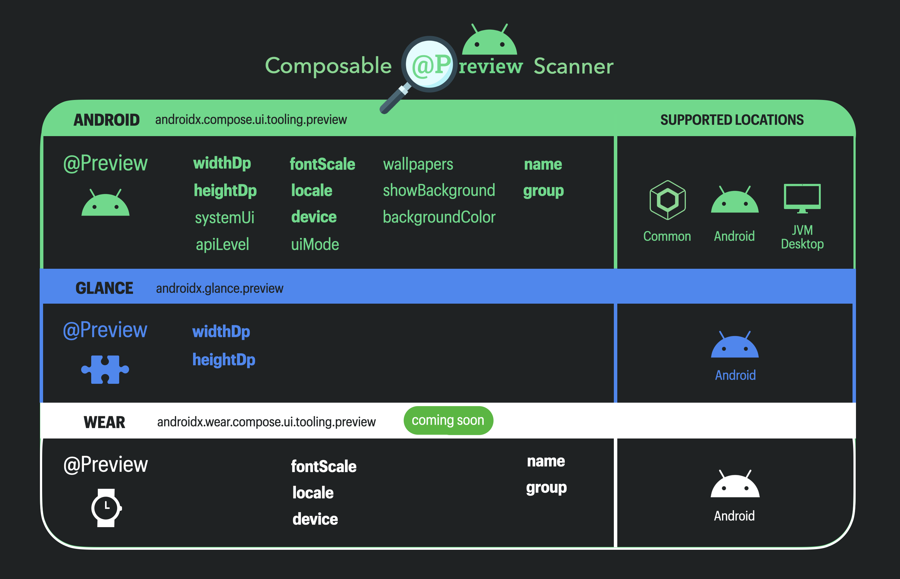

<a href="https://androidweekly.net/issues/issue-628">

</a><br/>
<a href="https://jetc.dev/issues/221.html"></a>

<p align="center">

</p><br/>

[](https://kotlinlang.org/docs/multiplatform.html) [](#) [](#)<br/>

A Compose Multiplatform friendly library to help auto-generate screenshot tests from Composable Previews (e.g. **Android**, **Glance**) with any screenshot testing library:
JVM-based (i.e. Paparazzi, Roborazzi) as well as Instrumentation-based (i.e. Shot, Dropshots, Android-Testify, etc.).

> [!IMPORTANT]
> **Roborazzi** has integrated Composable Preview Scanner (maven-central) as a core dependency for its native [Compose Preview support](https://github.com/takahirom/roborazzi?tab=readme-ov-file#compose-preview-support-experimental).<br/>

# Overview
[](https://jitpack.io/#sergio-sastre/ComposablePreviewScanner) <br/>
[](https://central.sonatype.com/artifact/io.github.sergio-sastre.ComposablePreviewScanner/android) <br/>
With over **300,000 monthly downloads** (JitPack + Maven Central), Composable Preview Scanner is a trusted solution for automated visual UI verification in the Compose ecosystem.


> [!NOTE]
> If you are still using the deprecated `org.jetbrains.compose.ui.tooling.preview.Preview`, see [README_DEPRECATED.md](README_DEPRECATED.md)<br/>

# Comparison with other solutions
|                                                      | Composable Preview Scanner                                | &nbsp;&nbsp;&nbsp;&nbsp;&nbsp;&nbsp;Showkase&nbsp;&nbsp;&nbsp;&nbsp;&nbsp;&nbsp; | Compose Preview Screenshot Testing          |
|------------------------------------------------------|-----------------------------------------------------------|----------------------------------------------------|---------------------------------------------|
| Independent of AGP version                           | ✅                                                         | ✅                                                  | ❌                                           |
| Library-agnostic solution                            | ✅                                                         | ✅                                                  | ❌<sup>1</sup>                               |
| Scans previews in different sources sets<sup>2</sup> | ✅&nbsp;main<br/>✅&nbsp;screenshotTest<br/>✅&nbsp;androidTest | ✅&nbsp;main<br/>❌&nbsp;screenshotTest<br/>❌&nbsp;androidTest | ❌&nbsp;main<br/>✅&nbsp;screenshotTest<br/>❌&nbsp;androidTest |
| Preview Infos available                              | ✅                                                         | ❌<sup>3</sup>                                      | ✅                                           |
| Specific Config (e.g. for Libs) available            | ✅<sup>4</sup>                                             | ❌                                                  | ⚠️<sup>5</sup>                               |
| Supported Preview types                              | ✅&nbsp;Android<br/>✅&nbsp;Glance<br/>❌&nbsp;Wear<sup>6</sup> | ✅&nbsp;Android<br/>❌&nbsp;Glance<br/>❌&nbsp;Wear | ✅&nbsp;Android<br/>❌&nbsp;Glance<br/>❌&nbsp;Wear |
| Supported Locations in Compose Multiplatform         | ✅&nbsp;Android<br/>✅&nbsp;Desktop/JVM<br/>✅&nbsp;Common | ✅&nbsp;Android<br/>❌&nbsp;Desktop/JVM<sup>7</sup><br/>❌&nbsp;Common | ✅&nbsp;Android<br/>✅&nbsp;Desktop/JVM<br/>❌&nbsp;Common |

<details>
<summary>Click to see comparison footnotes</summary>

<sup>1</sup> Compose Preview Screenshot Testing is a standalone solution based on LayoutLib, whereas ComposablePreviewScanner and Showkase provide Composables' infos so you can run screenshot tests with your favourite screenshot testing library.<br/><br/>
<sup>2</sup> From version 0.5.0, ComposablePreviewScanner can scan previews in any source set. Compose Preview Screenshot Testing requires to put the previews in a brand-new "screenshotTest" source.<br/><br/>
<sup>3</sup> Showkase components only hold information about the Composable, but not about the Preview Info (i.e. ApiLevel, Locale, UiMode, FontScale...).<br/><br/>
<sup>4</sup> ComposablePreviewScanner supports adding extra lib-config (e.g. Paparazzi's Rendering Mode or Roborazzi's compare options) in the form of annotations that are additionally added to the preview. You can check how in the examples below in [Jvm Screenshot Tests](#jvm-screenshot-tests) and [Instrumentation Screenshot Tests](#instrumentation-screenshot-tests) respectively.<br/><br/>
<sup>5</sup> Compose Preview Screenshot Testing supports *only general tolerance* via gradle plugin from version [0.0.1-alpha06](https://developer.android.com/studio/preview/compose-screenshot-testing#001-alpha06)<br/><br/>
<sup>6</sup> Wear Previews support is planned<br/><br/>
<sup>7</sup> [Showkase: Compose Multiplatform Support](https://github.com/airbnb/Showkase/issues/364)
</details><br/>

ComposablePreviewScanner also works with:
- **NEW** `@PreviewWrapper` (since 0.9.0+) automatically. No changes required in the Screenshot Testing library using ComposablePreviewScanner.
- `@PreviewParameters`
- `@PreviewScreenSizes`, `@PreviewFontScales`, `@PreviewLightDark` and `@PreviewDynamicColors` as well as custom multi-previews.
- `@Previews` with default-parameters (from version 0.5.1+)
- `@Previews` located in any source set, like "main", "screenshotTest" and "androidTest" (from version 0.5.0+)
- `@Previews` inside public classes<sup>1</sup> (from version 0.3.0+)
- private `@Previews` (from version 0.1.3+)

<sup>1</sup> The [Compose Preview Screenshot Testing tool](https://developer.android.com/studio/preview/compose-screenshot-testing) from Google requires you to put your `@Previews` inside a class.

## Compose Multiplatform Support
Compose Multiplatform allows you to use the standard Android Preview **`androidx.compose.ui.tooling.preview.Preview`** annotation across all relevant source sets, like **Android** and **Desktop** but also including `common`.
ComposablePreviewScanner can scan and run on both platforms, **Android** and **Desktop**, and additionally scan Previews in `common`.

For example, to scan previews located in both a platform-specific (`androidMain` or `desktopMain`) and a ui-shared (e.g. `commonMain`) source set, you would configure the scanner like this:

```kotlin
AndroidComposablePreviewScanner()
    .scanPackageTrees(
        include = listOf(
            "your.package.android_or_desktop", // platform-specific
            "your.package.common"              // commonMain
        )
    )
    .getPreviews()
```

> [!NOTE]
> Screenshot tests must run on a platform supported by your screenshot library.<br/>
> • Android: Paparazzi, Roborazzi & instrumentation libraries (e.g. Dropshots, Android-Testify) are supported.<br/>
> • Desktop: Roborazzi only.<br/>
> • Common: no library runs directly in common; run your tests from an Android or Desktop target instead. ComposablePreviewScanner can still find the Previews in common target packages.<br/>

You can find executable examples with Roborazzi here:
- [Android @Previews in common](https://github.com/sergio-sastre/roborazzi/blob/droidcon/preview_tests/sample-generate-preview-common/src/androidUnitTest/kotlin/com/github/takahirom/preview/tests/AndroidPreviewTest.kt)
- [Android @Previews in desktop](https://github.com/sergio-sastre/roborazzi/blob/droidcon/preview_tests/sample-generate-preview-desktop/src/desktopTest/kotlin/AndroidPreviewTest.kt)

If you are still using the deprecated Common or Desktop `@Preview` annotations, see [README_DEPRECATED.md](README_DEPRECATED.md) for guidance.

# How to set up
> [!WARNING]  
> Beware the prefixes:<br/>
> *Maven Central* -> **io.github**<br/>
> *JitPack* -> **com.github**<br/>

## Maven Central (since 0.3.2+)
```kotlin
dependencies {
    // android previews (androidx.compose.ui.tooling.preview.Preview)
    // supported in jvm targets e.g. android & desktop
    testImplementation("io.github.sergio-sastre.ComposablePreviewScanner:android:<version>")

    // glance previews (androidx.glance.preview.Preview)
    // supported since 0.7.0+ in android target
    testImplementation("io.github.sergio-sastre.ComposablePreviewScanner:glance:<version>")
}
```

## JitPack
Add JitPack to your root build.gradle file:
```kotlin
allprojects {
   repositories {
      maven { url = uri('https://jitpack.io') }
   }
}
```

```kotlin
dependencies {
    // android previews (androidx.compose.ui.tooling.preview.Preview)
    // supported in jvm targets e.g. android & desktop
    testImplementation("com.github.sergio-sastre.ComposablePreviewScanner:android:<version>")

    // glance previews (androidx.glance.preview.Preview)
    // supported since 0.7.0+ in android target
    testImplementation("com.github.sergio-sastre.ComposablePreviewScanner:glance:<version>")
}
```

# How to use
### Examples with Screenshot Testing Libraries (Android target)
1. [JVM Screenshot Tests](#jvm-screenshot-tests)<br/>
   1.1  [Paparazzi](#paparazzi)<br/>
   1.2  [Roborazzi (without configuring its plugin)](#roborazzi)<br/>
2. [Instrumentation Screenshot Tests](#instrumentation-screenshot-tests)

If you encounter any issues when executing the screenshot tests, take a look at the [Troubleshooting](#troubleshooting) section.

> [!NOTE]
> [Roborazzi](https://github.com/takahirom/roborazzi) has integrated ComposablePreviewScanner in its plugin since [version 1.22](https://github.com/takahirom/roborazzi/releases/tag/1.22.0)

### Related
1. [Glance Previews Support](#glance-previews-support)
2. [Compose Multiplatform Support](#compose-multiplatform-support)

## API   
`AndroidComposablePreviewScanner` and `GlanceComposablePreviewScanner` have the same API.
The API is pretty simple:

```kotlin
AndroidComposablePreviewScanner() // or GlanceComposablePreviewScanner()
    // Optional to log scanning info like scanning time or amount of previews found
    .enableScanningLogs()
    // Optional to scan previews in compiled classes of other source sets, like "screenshotTest" or "androidTest"
    // If omitted, it scans previews in 'main' at build time
    .setTargetSourceSet(
       Classpath(SourceSet.SCREENSHOT_TEST) // scan previews under "screenshotTest"
    )
    // Required: define where to scan for Previews.
    // See 'Scanning Source Options (packages, files, inputStreams)'
    .scanPackageTrees(
        include = listOf("your.package", "your.package2"),
        exclude = listOf("your.package.subpackage1", "your.package2.subpackage1")
    )
    // Optional to filter out scanned previews with any of the given annotations
    // Warning: this and its 'include' counterpart are mutually exclusive by API design
    .excludeIfAnnotatedWithAnyOf(
        ExcludeForScreenshot::class.java, 
        ExcludeForScreenshot2::class.java
    )
    // Optional to filter in only scanned previews with any of the given annotations
    // Warning: this and its 'exclude' counterpart are mutually exclusive by API design
    .includeIfAnnotatedWithAnyOf(
        IncludeForScreenshot::class.java,
        IncludeForScreenshot2::class.java
    )
    // Optional to include configuration info of the screenshot testing library in use
    // See 'How to use -> Libraries' above for further info
    .includeAnnotationInfoForAllOf(
        ScreenshotConfig::class.java,
        ScreenshotConfig2::class.java
    )
    // Optional to also provide private Previews
    .includePrivatePreviews()
    // Optional to filter by any previewInfo: heightDp, widthDp...
    .filterPreviews {
        previewInfo ->  previewInfo.heightDP >= 800
    }
    // ---
    .getPreviews()
```

## Scanning

### Scanning Source Sets (screenshotTest, androidTest, main)
By default, ComposablePreviewScanner scans `@Preview`s in the `main` Source Set at build time.
However, one can scan previews in other Source Sets different from `main` by using `.setTargetSourceSet(classpath:Classpath)`,
where `classpath` is the local path to the compiled classes of that Source Set.<br/>
ComposablePreviewScanner provides some default values to facilitate this:
```kotlin
// Previews under "screenshotTest"
Classpath(SourceSet.SCREENSHOT_TEST)

// Previews under "androidTest"
Classpath(SourceSet.ANDROID_TEST)
```

<details>
<summary>Click to see scanning Source Set instructions</summary>

#### Ensure compiled classes exist
You have to make sure the corresponding compiled classes for that Source Set exist and are up to date.
The simplest way is to execute the corresponding compile task before running your tests or dumping the scan result to a file, namely `<module>:compile<Variant><Sourceset>Kotlin`, for instance
1. ScreenshotTest 
   - Debug ->   `:mymodule:compileDebugScreenshotTestKotlin`
   - Release -> `:mymodule:compileReleaseScreenshotTestKotlin`
2. AndroidTest
   - Debug ->   `:mymodule:compileDebugAndroidTestKotlin`
   - Release -> `:mymodule:compileReleaseAndroidTestKotlin`

To ensure you don't forget it, you can configure gradle accordingly, so those tasks are always executed previously.
For instance, if you're using Roborazzi or Paparazzi and want to scan previews in the `screenshotTest` Source Set for the `debug` variant
```kotlin
// Create Compiled Classes always before unit tests, including Roborazzi/Paparazzi tests
tasks.withType<Test> {
   dependsOn("compileDebugScreenshotTestKotlin")
}
```

#### Ensure Source Set dependencies available in tests
Last but not least, make sure all the code inside the previews of the target Source Set is also
available in `test` (for Roborazzi and Paparazzi) or `android test` (for any instrumentation-based library).<br/>
So, let's say that you only have `@Preview`s in `screenshotTest`, and not in `main`. Therefore you've only added that dependency to `screenshotTest`:
```kotlin
screenshotTestImplementation("androidx.compose.ui:ui-tooling-preview:<version>")
```
If you're running Roborazzi or Paparazzi screenshot tests, you'll need to add that dependency to 'test' build Type
```kotlin
screenshotTestImplementation("androidx.compose.ui:ui-tooling-preview:<version>")
testImplementation("androidx.compose.ui:ui-tooling-preview:<version>")
```

> [!WARNING]
> For instrumentation tests and Source Sets different from `main` or `androidTest`, like `screenshotTest`, you'll also need to ensure that the classes of those source sets
> are also included in the .apk installed on the device or emulator, or it will throw ClassNotFoundErrors.
>
> The easiest way to achieve this is to add the following code snippet to your gradle file:
> ```kotlin
> val includeScreenshotTests = project.hasProperty("includeSourceSetScreenshotTest")
> if (includeScreenshotTests) {
>     sourceSets {
>        getByName("androidTest") {
>           java.srcDir("src/screenshotTest/java") //or kotlin
>           res.srcDir("src/screenshotTest/res")
>        }
>     }
>}
> ```
> And pass that gradle property when executing the screenshot tests via command-line, e.g.:
> `./gradlew :tests:screenshotRecord -PincludeSourceSetScreenshotTest`
>
> This is NOT necessary for JVM-based screenshot testing libraries like Roborazzi and Paparazzi

</details>

### Scanning Source Options (packages, files, inputStreams)
<details>
<summary>Click to see scanning source options</summary>

Apart from `scanPackageTrees(include:List<String>, exclude:List<String>)`, there are 2 more options to scan previews:
1. All Packages: `scanAllPackages()`. This might require a huge amount of memory since it would scan not only in a set of packages, but in all packages used in your app/module (i.e. also in its transitive dependencies). This is in 99% of the cases unnecessary, and scanning the main package trees of your module should be sufficient. 
2. From a file containing the ScanResult. This speeds up your screenshot tests, since it avoids the time-consuming process of scanning each time by reusing previously scanned data: <br/>
   2.1. `scanFile(jsonFile: File)`. Use this for JVM-based screenshot testing libraries (i.e. Roborazzi & Paparazzi).<br/>
   2.2. `scanFile(targetInputStream: InputStream, customPreviewsInfoInputStream: InputStream)`. This is meant for Instrumentation-based screenshot testing libraries.<br/><br/>
You can create a unit test for that:

```kotlin
class SaveScanResultInFiles {
    @Test
    fun `task -- save scan result in file`() {
        val scanResultFileName = "scan_result.json"

        ScanResultDumper()
            .setTargetSourceSet(Classpath(SourceSet.ANDROID_TEST)) // optional
            .scanPackageTrees("my.package")
            // for unit tests
            .dumpScanResultToFile(scanResultFileName)
            // for instrumentation tests
            .dumpScanResultToFileInAssets(
               flavourName = "myFlavour",
               fileName = scanResultFileName
            )
    }
}
```
</details>

## JVM Screenshot Tests

### Paparazzi
You can find [executable examples here](https://github.com/sergio-sastre/Android-screenshot-testing-playground/tree/master/lazycolumnscreen-previews/paparazzi/src)

> [!NOTE]
> You can also find a paparazzi-plugin in this repo that generates all this boilerplate code for you!
> Take a look at [its README.md](paparazzi-plugin/README.md)

<details>
<summary>Click to see Paparazzi implementation details</summary>

Let's say we want to enable some custom Paparazzi config for some Previews, for instance a maxPercentDifference value

1. Define your own annotation for the Lib config.
```kotlin
annotation class PaparazziConfig(val maxPercentDifference: Double)
```

2. Annotate the corresponding Previews accordingly (you do not need to annotate all):
```kotlin
@PaparazziConfig(maxPercentDifference = 0.1)
@Preview(uiMode = Configuration.UI_MODE_NIGHT_YES)
@Composable
fun MyComposable(){
   // Composable code here
}
```
3. Create custom record and verify `SnapshotHandler`s for better control over the screenshot file names.

By default, Paparazzi prefixes all generated screenshot files using its internal `SnapshotHandler`. While this works for most cases, it causes issues in parameterized tests: the default `SnapshotHandler` includes the test [index] in the filename. If the order of your previews changes, filenames no longer match, which can break snapshot verification.<br/><br/>
   To solve this, we can create custom `SnapshotHandler`s that use a fixed prefix, like "Paparazzi_Preview_Test", instead of a test-index-dependent name. This ensures filenames remain stable regardless of test order.
```kotlin
// Define the prefix = <packageName>_<className>_<methodName>
private val paparazziTestName =
   TestName(packageName = "Paparazzi", className = "Preview", methodName = "Test")

private class PreviewSnapshotVerifier(
   maxPercentDifference: Double
): SnapshotHandler {
   private val snapshotHandler = SnapshotVerifier(
      maxPercentDifference = maxPercentDifference
   )
   override fun newFrameHandler(
      snapshot: Snapshot,
      frameCount: Int,
      fps: Int
   ): SnapshotHandler.FrameHandler {
      val newSnapshot = Snapshot(
         name = snapshot.name,
         testName = paparazziTestName,
         timestamp = snapshot.timestamp,
         tags = snapshot.tags,
         file = snapshot.file,
      )
      return snapshotHandler.newFrameHandler(
         snapshot = newSnapshot,
         frameCount = frameCount,
         fps = fps
      )
   }

   override fun close() {
      snapshotHandler.close()
   }
}

private class PreviewHtmlReportWriter: SnapshotHandler {
   private val snapshotHandler = HtmlReportWriter()
   override fun newFrameHandler(
      snapshot: Snapshot,
      frameCount: Int,
      fps: Int
   ): SnapshotHandler.FrameHandler {
      val newSnapshot = Snapshot(
         name = snapshot.name,
         testName = paparazziTestName,
         timestamp = snapshot.timestamp,
         tags = snapshot.tags,
         file = snapshot.file,
      )
      return snapshotHandler.newFrameHandler(
         snapshot = newSnapshot,
         frameCount = frameCount,
         fps = fps
      )
   }

   override fun close() {
      snapshotHandler.close()
   }
}

In the next step, we’ll show how to pass these custom SnapshotHandlers to the Paparazzi TestRule to take full control of screenshot filenames.

4. Map the PreviewInfo and PaparazziConfig values.

```kotlin
class Dimensions(
   val screenWidthInPx: Int,
   val screenHeightInPx: Int
)

object ScreenDimensions {
   fun dimensions(
      parsedDevice: Device,
      widthDp: Int,
      heightDp: Int
   ): Dimensions {
      val conversionFactor = parsedDevice.densityDpi / 160f
      val previewWidthInPx = ceil(widthDp * conversionFactor).toInt()
      val previewHeightInPx = ceil(heightDp * conversionFactor).toInt()
      return Dimensions(
         screenHeightInPx = when (heightDp > 0) {
            true -> previewHeightInPx
            false -> parsedDevice.dimensions.height.toInt()
         },
         screenWidthInPx = when (widthDp > 0) {
            true -> previewWidthInPx
            false -> parsedDevice.dimensions.width.toInt()
         }
      )
   }
}

object DeviceConfigBuilder {
   fun build(preview: AndroidPreviewInfo): DeviceConfig {
      val parsedDevice =
         DevicePreviewInfoParser.parse(preview.device)?.inPx() ?: return DeviceConfig()

      val dimensions = ScreenDimensions.dimensions(
         parsedDevice = parsedDevice,
         widthDp = preview.widthDp,
         heightDp = preview.heightDp
      )

      return DeviceConfig(
         screenHeight = dimensions.screenHeightInPx,
         screenWidth = dimensions.screenWidthInPx,
         density = Density(parsedDevice.densityDpi),
         xdpi = parsedDevice.densityDpi, // not 100% precise
         ydpi = parsedDevice.densityDpi, // not 100% precise
         size = ScreenSize.valueOf(parsedDevice.screenSize.name),
         ratio = ScreenRatio.valueOf(parsedDevice.screenRatio.name),
         screenRound = ScreenRound.valueOf(parsedDevice.shape.name),
         orientation = ScreenOrientation.valueOf(parsedDevice.orientation.name),
         locale = preview.locale.ifBlank { "en" },
          fontScale = preview.fontScale,
         nightMode = when (preview.uiMode and UI_MODE_NIGHT_MASK == UI_MODE_NIGHT_YES) {
            true -> NightMode.NIGHT
            false -> NightMode.NOTNIGHT
         }
      )
   }
}

object PaparazziPreviewRule {
    const val UNDEFINED_API_LEVEL = -1
    const val MAX_API_LEVEL = 36
    
    fun createFor(preview: ComposablePreview<AndroidPreviewInfo>): Paparazzi {
       val previewInfo = preview.previewInfo
       val previewApiLevel = when(previewInfo.apiLevel == UNDEFINED_API_LEVEL) {
          true -> MAX_API_LEVEL
          false -> previewInfo.apiLevel
       }
       // other library configurations...
       val tolerance = preview.getAnnotation<PaparazziConfig>()?.maxPercentDifference ?: 0.0
       return Paparazzi(
            environment = detectEnvironment().copy(compileSdkVersion = previewApiLevel),
            deviceConfig = DeviceConfigBuilder.build(previewInfo),
            supportsRtl = true,
            showSystemUi = previewInfo.showSystemUi,
            renderingMode = when {
                previewInfo.showSystemUi -> SessionParams.RenderingMode.NORMAL
                previewInfo.widthDp > 0 && previewInfo.heightDp > 0 -> SessionParams.RenderingMode.FULL_EXPAND
                else -> SessionParams.RenderingMode.SHRINK
            },
            snapshotHandler = when(System.getProperty("paparazzi.test.verify")?.toBoolean() == true) {
               true -> PreviewSnapshotVerifier(tolerance)
               false -> PreviewHtmlReportWriter()
            },
            maxPercentDifference = tolerance
        )
    }
}

/**
 * A composable function that wraps content inside a Box with a specified size
 * This is used to simulate what previews render when showSystemUi is true:
 * - The Preview takes up the entire screen
 * - The Composable still keeps its original size,
 * - Background color of the Device is white,
 *   but the @Composable background color is the one defined in the Preview
 */
@Composable
fun SystemUiSize(
   widthInDp: Int,
   heightInDp: Int,
   content: @Composable () -> Unit
) {
   Box(Modifier
      .size(
         width = widthInDp.dp,
         height = heightInDp.dp
      )
      .background(Color.White)
   ) {
      content()
   }
}

// Additional to support @Preview's 'showBackground' and 'backgroundColor' properties
@Composable
fun PreviewBackground(
    showBackground: Boolean,
    backgroundColor: Long,
    content: @Composable () -> Unit
) {
    when (showBackground) {
        false -> content()
        true -> {
            val color = when (backgroundColor != 0L) {
                true -> Color(backgroundColor)
                false -> Color.White
            }
            Box(Modifier.background(color)) {
                content()
            }
        }
    }
}

5. Create the corresponding Parameterized Test:

```kotlin
@RunWith(Parameterized::class)
class PreviewTestParameterTests(
    val preview: ComposablePreview<AndroidPreviewInfo>,
) {

   companion object {
      // Optimization: This avoids scanning for every test
      private val cachedPreviews: List<ComposablePreview<AndroidPreviewInfo>> by lazy {
         AndroidComposablePreviewScanner()
            .scanPackageTrees("your.package", "your.package2")
            .includeAnnotationInfoForAllOf(PaparazziConfig::class.java)
            .getPreviews()
      }

      @JvmStatic
      @Parameterized.Parameters
      fun values(): List<ComposablePreview<AndroidPreviewInfo>> = cachedPreviews
   }

    @get:Rule
    val paparazzi: Paparazzi = PaparazziPreviewRule.createFor(preview)

    @Test
    fun snapshot() {
        val screenshotId = AndroidPreviewScreenshotIdBuilder(preview).build()
       
        paparazzi.snapshot(name = screenshotId) {
            val previewInfo = preview.previewInfo
            when (previewInfo.showSystemUi) {
                false -> PreviewBackground(
                    showBackground = previewInfo.showBackground,
                    backgroundColor = previewInfo.backgroundColor
                ) {
                    preview()
                }

                true -> {
                    val parsedDevice = (DevicePreviewInfoParser.parse(previewInfo.device) ?: DEFAULT).inDp()
                    SystemUiSize(
                        widthInDp = parsedDevice.dimensions.width.toInt(),
                        heightInDp = parsedDevice.dimensions.height.toInt()
                    ) {
                        PreviewBackground(
                            showBackground = true,
                            backgroundColor = previewInfo.backgroundColor,
                        ) {
                            preview()
                        }
                    }
                }
            }
        }
    }
}
```

6. Run these Paparazzi tests together with the existing ones by executing the corresponding command e.g. `./gradlew yourModule:recordPaparazziDebug`
</details>

### Roborazzi
You can find [executable examples here](https://github.com/sergio-sastre/Android-screenshot-testing-playground/tree/master/lazycolumnscreen-previews/roborazzi/src)

<details>
<summary>Click to see Roborazzi implementation details</summary>

Let's say we want to enable some custom Roborazzi Config for some Previews, for instance a maxPercentDifferent value

1. Define your own annotation for the Lib Config.
```kotlin
annotation class RoborazziConfig(val comparisonThreshold: Double)
```

2. Annotate the corresponding Previews accordingly:
```kotlin
@RoborazziConfig(comparisonThreshold = 0.1)
@Preview(uiMode = Configuration.UI_MODE_NIGHT_YES)
@Composable
fun MyComposable(){
    // Composable code here
}
```

3. Map the PreviewInfo and RoborazziConfig values.

```kotlin
object RoborazziOptionsMapper {
    fun createFor(preview: ComposablePreview<AndroidPreviewInfo>): RoborazziOptions =
       preview.getAnnotation<RoborazziConfig>()?.let { config ->
          RoborazziOptions(
             compareOptions = CompareOptions(resultValidator = ThresholdValidator(config.comparisonThreshold))
          )
       } ?: RoborazziOptions()
}

object RoborazziComposeOptionsMapper {
    @OptIn(ExperimentalRoborazziApi::class)
    fun createFor(preview: ComposablePreview<AndroidPreviewInfo>): RoborazziComposeOptions =
        RoborazziComposeOptions {
            val previewInfo = preview.previewInfo
            previewDevice(previewInfo.device.ifBlank { Devices.NEXUS_5 } )
            size(
                widthDp = previewInfo.widthDp,
                heightDp = previewInfo.heightDp
            )
            background(
                showBackground = previewInfo.showBackground,
                backgroundColor = previewInfo.backgroundColor
            )
            locale(previewInfo.locale)
            uiMode(previewInfo.uiMode)
            fontScale(previewInfo.fontScale)
        }
}
```
Check the following link for a full list of [Robolectric device qualifiers](https://robolectric.org/device-configuration/) and this blog post on how to [set the cumulative Qualifiers dynamically](https://sergiosastre.hashnode.dev/efficient-testing-with-robolectric-roborazzi-across-many-ui-states-devices-and-configurations)

4. Create the corresponding Parameterized Test:

```kotlin
@RunWith(ParameterizedRobolectricTestRunner::class)
class PreviewParameterizedTests(
    private val preview: ComposablePreview<AndroidPreviewInfo>,
) {

    companion object {
        // Optimization: This avoids scanning for every test
        private val cachedPreviews: List<ComposablePreview<AndroidPreviewInfo>> by lazy {
            AndroidComposablePreviewScanner()
                .scanPackageTrees("your.package", "your.package2")
                .filterPreviews { previewParams -> previewParams.apiLevel == 30 }
                .includeAnnotationInfoForAllOf(RoborazziConfig::class.java)
                .getPreviews()
        }

        @JvmStatic
        @ParameterizedRobolectricTestRunner.Parameters
        fun values(): List<ComposablePreview<AndroidPreviewInfo>> = cachedPreviews
    }

    // Recommended for more meaningful screenshot file names. See #Advanced Usage
    fun screenshotNameFor(preview: ComposablePreview<AndroidPreviewInfo>): String =
        "$DEFAULT_ROBORAZZI_OUTPUT_DIR_PATH/${AndroidPreviewScreenshotIdBuilder(preview).build()}.png"

    @GraphicsMode(GraphicsMode.Mode.NATIVE)
    @Config(sdk = [30]) // same as the previews we've filtered
    @Test
    fun snapshot() {
        captureRoboImage(
           filePath = screenshotNameFor(preview),
           roborazziOptions = RoborazziOptionsMapper.createFor(preview),
           roborazziComposeOptions = RoborazziComposeOptionsMapper.createFor(preview)
        ) {
            preview()
        }
    }
}
```

5. Run these Roborazzi tests together with the existing ones by executing the corresponding command e.g. `./gradlew yourModule:recordRoborazziDebug`
</details>

## Instrumentation Screenshot Tests
You can find executable examples that use ComposablePreviewScanner with the different instrumentation-based libraries in the corresponding links below:
- [Dropshots](https://github.com/sergio-sastre/Android-screenshot-testing-playground/tree/master/recyclerviewscreen-previews/dropshots)
- [Shot](https://github.com/sergio-sastre/Android-screenshot-testing-playground/tree/master/recyclerviewscreen-previews/shot)
- [Android-Testify](https://github.com/sergio-sastre/Android-screenshot-testing-playground/tree/master/recyclerviewscreen-previews/android-testify)<br/>

Android does not use the standard Java bytecode format and does not actually even have a runtime classpath.
Moreover, the "build" folders, where the compiled classes are located, are not accessible from instrumentation tests.
Therefore, the current way to support instrumentation tests, is by previously dumping the relevant classes into a file and moving it into a folder that can be accessed while running instrumentation tests.
<details>
<summary>Click to see Instrumentation implementation details</summary>

1. run the scan in a unit test & save it in a file accessible by instrumentation tests e.g. in assets

```kotlin
class SaveScanResultInAssets {
    @Test
    fun `task -- save scan result in assets`() {
        val scanResultFileName = "scan_result.json"

        ScanResultDumper()
            .scanPackageTrees("my.package")
            .dumpScanResultToFileInAssets(
                fileName = scanResultFileName
            )

        assert(
           assetsFilePath(
               fileName = scanResultFileName
           ).exists())
    }
}
```

Ensure that the .json with the scan result is up-to-date before executing the instrumentation screenshot tests. For instance, execute that test always before your instrumentation screenshot tests.
Ideally, this scanning could be done via a Gradle Plugin in the future instead of by running it in a unit test.

2. Now proceed to prepare your Composable Preview Tests with, for instance, Dropshots.
Let's say we want to enable some custom Dropshots Config for some Previews, for instance a maxPercentDifferent value.
   - Define your own annotation
      ```kotlin
      annotation class DropshotsConfig(val comparisonThreshold: Double)
      ```
   - Annotate the corresponding Previews accordingly:
   ```kotlin
   @DropshotsConfig(comparisonThreshold = 0.15)
   @Preview(uiMode = Configuration.UI_MODE_NIGHT_YES)
   @Composable
   fun MyComposable() {
      // Composable code here
   }
   ```
   - Map the PreviewInfo and DropshotsConfig values. For instance, you can use a custom class for that. To map the Preview Info values, I recommend to use the ActivityScenarioForComposableRule of [AndroidUiTestingUtils](https://github.com/sergio-sastre/AndroidUiTestingUtils)

   ```kotlin
   object DropshotsPreviewRule {
      fun createFor(preview: ComposablePreview<AndroidPreviewInfo>): Dropshots =
         preview.getAnnotation<DropshotsConfig>()?.let { config ->
            Dropshots(
               resultValidator = ThresholdValidator(config.comparisonThreshold)
            )
         } ?: Dropshots()
   }

   object ActivityScenarioForComposablePreviewRule {
       fun createFor(preview: ComposablePreview<AndroidPreviewInfo>): ActivityScenarioForComposableRule {
           val uiMode =
               when (preview.previewInfo.uiMode and UI_MODE_NIGHT_MASK == UI_MODE_NIGHT_YES) {
                   true -> UiMode.NIGHT
                   false -> UiMode.DAY
               }

           val orientation =
               when (DevicePreviewInfoParser.parse(preview.previewInfo.device)?.orientation == Orientation.LANDSCAPE) {
                   true -> ComposableConfigOrientation.LANDSCAPE
                   false -> ComposableConfigOrientation.PORTRAIT
               }

           val locale =
               preview.previewInfo.locale.removePrefix("b+").replace("+", "-").ifBlank { "en" }

           return ActivityScenarioForComposableRule(
               backgroundColor = Color.TRANSPARENT,
               config = ComposableConfigItem(
                   uiMode = uiMode,
                   fontSize = FontSizeScale.Value(preview.previewInfo.fontScale),
                   orientation = orientation,
                   locale = locale
               )
           )
       }
   }
   ```

3. Create the corresponding Parameterized Test:

```kotlin
   @RunWith(ParameterizedTestRunner::class)
   class PreviewParameterizedTests(
      private val preview: ComposablePreview<AndroidPreviewInfo>,
   ) {

      companion object {
        private val cachedPreviews: List<ComposablePreview<AndroidPreviewInfo>> by lazy {
            AndroidComposablePreviewScanner()
                  .scanFile(getInstrumentation().context.assets.open("scan_result.json"))
                  .includeAnnotationInfoForAllOf(DropshotsConfig::class.java)
                  .getPreviews()
        }
   
         @JvmStatic
         @ParameterizedTestRunner.Parameters
         fun values(): List<ComposablePreview<AndroidPreviewInfo>> = cachedPreviews
      }
   
      @get:Rule
      val dropshots: Dropshots = DropshotsPreviewRule.createFor(preview)
   
      @get:Rule
      val activityScenarioForComposableRule: ActivityScenarioForComposableRule = 
            ActivityScenarioForComposablePreviewRule.createFor(preview)

      @Test
      fun snapshot() {
        activityScenarioForComposableRule.onActivity {
            it.setContent {
                preview()
            }
        }

        dropshots.assertSnapshot(
            view = activityScenarioForComposableRule.activity.waitForComposeView()
        )
      }
   }
   ```

   - Run these Dropshots tests together with the existing ones by executing the corresponding command e.g. `./gradlew yourModule:connectedAndroidTest -Pdropshots.record`

> [!WARNING]
> Beware that Locale Strings in Preview Infos, unlike AndroidUiTestingUtils, use The BCP-47 tag but with + instead of - as separators, and have the prefix b+. Therefore, the BCP-47 tag "zh-Hans-CN" would be written as "b+zh+Hans+CN" instead. 
> So for this case, you'd have to convert locale "b+zh+Hans+CN" to "zh-Hans-CN" in order to use it with AndroidUiTestingUtils, for instance as showcased above: <br/>
> `val locale = preview.previewInfo.locale.removePrefix("b+").replace("+", "-").ifBlank { "en" }`
</details>

## Advanced Usage
### Screenshot File Names
ComposablePreviewScanner also provides classes to customize the name of the generated screenshots based on its Preview Info.
These are `AndroidPreviewScreenshotIdBuilder`, `GlancePreviewScreenshotIdBuilder` and `CommonPreviewScreenshotIdBuilder` respectively, and they both share the same API.
By default, these classes do not include the Preview Info in the screenshot file name if it is the same as its default value, but it can be configured to behave differently.
That means, for @Preview(showBackground = false), showBackground would not be included in the screenshot file name since it is the default.

<details>
<summary>Click to see screenshot naming configuration example</summary>

```kotlin 
AndroidPreviewScreenshotIdBuilder(preview)
    .ignoreClassName()
    .ignoreMethodName()
    // use this if you have previews in the same file with the same method name but different signature
    .doNotIgnoreMethodParametersType()
    // use this if you prefer index instead of displayName when using PreviewParameters
    .replaceDisplayNameWithIndex()
    .ignoreIdFor("heightDp")
    .ignoreIdFor("widthDp")
    .overrideDefaultIdFor(
       previewInfoName = "showBackground",
       applyInfoValue = { info ->
           when (info.showBackground) {
               true -> "WITH_BACKGROUND"
               false -> "WITHOUT_BACKGROUND"
           }
       }
    )
    .build()
```

and then in your test
```kotlin
@Test
fun snapshot() {
    paparazzi.snapshot(
        name = createScreenshotIdFor(preview)
    ) {
        preview()
    }
}
```

So, for the following Preview
```kotlin
class MyClass {
    
    @Preview(widthDp = 33, heightDp = 33, fontScale = 1.5f)
    @Composable
    fun MyComposable(){
        // Composable code here
    }
}
```
createScreenshotIdFor(preview) will generate the following id: `"MyClass.MyComposable.FONT_1_5f_WITHOUT_BACKGROUND"`
</details>

### Parsing Preview Device String (Android Previews)
Since 0.4.0, ComposablePreviewScanner also provides `DevicePreviewInfoParser.parse(device: String)`
which returns a `Device` object containing all the necessary information to support different devices in your Roborazzi & Paparazzi screenshot tests!

<details>
<summary>Click to see device string parsing examples</summary>

It can parse ALL possible combinations of "device strings" up to Android Studio Quail, namely:
```kotlin
// The over 80 devices supported either by id and/or name, for instance:
@Preview(device = "id:pixel_10_pro")
@Preview(device = "name:Pixel 10 Pro")
@Preview(device = "spec:parent=pixel_10_pro, orientation=landscape, navigation=buttons")

// And custom devices
@Preview(device = "spec:width = 411dp, height = 891dp, orientation = landscape, dpi = 420, isRound = false, chinSize = 0dp, cutout = corner")
@Preview(device = "spec:id=reference_desktop,shape=Normal,width=1920,height=1080,unit=px,dpi=160") // in pixels
@Preview(device = "spec:id=reference_desktop,shape=Normal,width=1920,height=1080,unit=dp,dpi=160") // in dp
```
For further info on how to use them, see [Roborazzi](#roborazzi) and [Paparazzi](#paparazzi) sections respectively.
</details>

## How it works
This library is written on top of [ClassGraph](https://github.com/classgraph/classgraph), an uber-fast parallelized classpath scanner.

ClassGraph can scan everything that is available either at bytecode level or at runtime.
This is also the case of annotations without retention or with either `AnnotationRetention.BINARY` or `AnnotationRetention.RUNTIME`, like Android, Glance and Wear Composable Previews
```kotlin
package androidx.compose.ui.tooling.preview

@Retention(AnnotationRetention.BINARY)
annotation class Preview(
   // Preview code here ...
)
```
__
## Glance Previews Support
You can find executable examples in this repo with different screenshot libraries:
- [Roborazzi](tests/src/test/java/sergio/sastre/composable/preview/scanner/tests/roborazzi/RoborazziGlanceComposablePreviewInvokeTests.kt)
- [Paparazzi](tests/src/test/java/sergio/sastre/composable/preview/scanner/tests/paparazzi/PaparazziGlanceComposablePreviewInvokeTests.kt)
- [Android-Testify](tests/src/androidTest/java/sergio/sastre/composable/preview/scanner/screenshots/AndroidTestifyGlanceComposablePreviewScannerInstrumentationTest.kt) (Check the [instrumentation-screenshot-tests](#instrumentation-screenshot-tests) section before)

<details>
<summary>Click to see Glance implementation details</summary>

To write such screenshot tests you have to:
1. Add `:glance` dependency for ComposablePreviewScanner e.g. `io.github.sergio-sastre.ComposablePreviewScanner:glance:<version>`. This contains some utils to correctly set the size of the Composable as well as the size of the device. Take a look at the executable examples above to see how they are used.
2. Ensure `targetSdk` is set to any value in the gradle file<sup>1</sup>. Otherwise you can see some discrepancies between the Preview and the generated screenshot file for Glance `@Preview`s without `widthDp`.
3. Write the Parameterized screenshot test like in the examples above.

<sup>1</sup> Unfortunately, Paparazzi is not able to always render screenshots accurately for Glance `@Preview`s without `widthDp`.
</details>

# Conferences & Community
<details>
<summary>Click to see talks, blog posts, and books</summary>

## Tech talks
The benefits and usage of ComposablePreviewScanner have been featured at major Android conferences:
- **Droidcon Lisbon & Berlin 2025**:<br/>
  [Let's @Preview the future: Automating Screenshot Testing in Compose Multiplatform](https://www.youtube.com/watch?v=zYsNXrf2-Lo) by Sergio Sastre
- **Droidcon Lisbon 2024**:<br/>
  [Composable Preview Driven Development: TDD-fying your UI with ease!](https://www.youtube.com/watch?v=cDqdosrS83k) by Sergio Sastre
- **DroidKaigi 2024** [JA 🇯🇵 / EN 🇬🇧 slides]:<br/>
  [Understand the mechanism! Let's do screenshots testing of Compose Previews with various variations](https://www.youtube.com/watch?app=desktop&v=c4AxUXTQgw4) by [Sumio Toyama](https://x.com/sumio_tym)
- **Skool Android Community**:<br/>
  [“Fast Feedback loops & Composable Preview Scanner”](https://www.youtube.com/watch?v=SphQelcGdHk) by Sergio Sastre

## Blog posts
- [Automating screens verification with Roborazzi and GitHub Actions](https://medium.com/@matiasdelbel/automating-screens-verification-with-roborazzi-and-github-actions-473b3301a5c0) by Matías del Bel
- [Implementing Screenshot Testing in the Unlimited Android App Was Tougher Than Expected](https://blog.kinto-technologies.com/posts/2024-12-13-Introducing-Screenshot-Testing-in-UnlimitedApp-en/) by KINTO Technologies

## Books
- [Mastering Android Screenshot Testing](https://alexzh.com/books/mastering-android-screenshot-testing/) by Alex Zhukovich
</details>

# Engineering Quality
The core of ComposablePreviewScanner is developed using **Test-Driven Development (TDD)** to ensure maximum stability and reliability across the diverse Compose ecosystem. This rigorous approach is a primary reason for its high adoption rate and minimal bug reports despite handling complex bytecode scanning.

To maintain strict binary compatibility for library consumers, the project uses **Metalava** to track and enforce API standards.

## Automated Verification
To ensure continuous quality, the following custom Gradle tasks handle environment prerequisites and integration testing.
<details>
<summary>Click to see the list of custom Gradle tasks</summary>

These tasks are executed locally during development and automatically in our **CI pipeline** for every PR:
1. API logic tests:`./gradlew :tests:testApi`
2. SourceSet logic tests: `./gradlew :tests:testSourceSets`
3. Paparazzi integration tests: `./gradlew :tests:paparazziPreviews` and `./gradlew :tests:paparazziPreviews -Pverify=true`
4. Roborazzi integration tests: `./gradlew :tests:roborazziPreviews` and `./gradlew :tests:roborazziPreviews -Pverify=true`

Custom gradle tasks for Android-testify integration tests (i.e. instrumentation screenshot testing libraries) coming soon
</details>

# Troubleshooting
<details>
<summary>Click to see solution for common issues</summary>

## Slow JVM Screenshot tests
JVM Screenshot tests can consume significant memory, and ComposablePreviewScanner may require even more RAM when scanning large sets of subpackages.
To improve performance, you can increase the RAM allocated to your unit tests by configuring your Gradle file as follows:
```kotlin
testOptions.unitTests {
    all { test ->
        // allocate 4GB RAM
        test.jvmArgs("-Xmx4g")
    }
}
```
This adjustment helps reduce test execution time during large scans.

## java.io.FileNotFoundException (File name too long)
`java.io.FileNotFoundException: ... (File name too long)`<br/>
This is more likely to happen when using Paparazzi. By default, Paparazzi additionally prefixes the screenshot file named internally instead of just using the `name` we pass to its `snapshot()` method, and this results sometimes in the final screenshot file name being longer than allowed.<br/><br/>
That is why it is recommended to [set a custom SnapshotHandler](#paparazzi) in the Paparazzi Test Rule.

But if you're still experiencing such issues, consider:
1. Using `AndroidPreviewScreenshotIdBuilder` methods like `ignoreIdFor()` or `overrideDefaultIdFor()` to shorten the given name.
2. Avoid `AndroidPreviewScreenshotIdBuilder` and use `paparazzi.snapshot {}` instead of `paparazzi.snapshot(name = screenshotId)`

## java.lang.IllegalArgumentException: Generated method name contains invalid characters
Some libraries restrict the characters allowed in filenames and may alter the provided screenshot name (e.g., Paparazzi 1.3.5+ like reported in this issue [here](https://github.com/cashapp/paparazzi/issues/1963)).
This is especially problematic when the `TestParameterInjector` test runner is used.<br/>
To avoid issues, `ComposablePreviewScanner`s ScreenshotIdBuilders should be used with the standard JUnit4 `Parameterized` test runner, and invalid characters should be encoded if needed:<br/>

ComposablePreviewScanner 0.8.0+
```kotlin
AndroidPreviewScreenshotIdBuilder(preview)
    ...
    .encodeUnsafeCharacters()
    .build()
```

ComposablePreviewScanner < 0.8.0:
You have to encode them manually
```kotlin
AndroidPreviewScreenshotIdBuilder(preview)
    ...
    .build()
    .replace("<", "%3C")
    .replace(">", "%3E")
    .replace("?", "%3F")
```
> [!NOTE]
> When using `TestParameterInjector` invalid characters may persist.
> Use the JUnit4 `Parameterized` test runner for valid results.

## Cannot inline bytecode built with JVM target 17
```text
Task compileDebugUnitTestKotlin FAILED
e: file:... Cannot inline bytecode built with JVM target 17 into bytecode that is being built with JVM target 11. Specify proper '-jvm-target' option.
```

You need to upgrade the 'jvmTarget' in the gradle build file of the module where it is failing like this:
```kotlin
kotlin {
    compilerOptions {
        jvmTarget = JvmTarget.JVM_17 // or higher
    }
}
```

## GooglePlayServicesMissingManifestValueException
```text
com.google.android.gms.common.GooglePlayServicesMissingManifestValueException: A required meta-data tag in your app's AndroidManifest.xml does not exist.  You must have the following declaration within the <application> element:     <meta-data android:name="com.google.android.gms.version" android:value="@integer/google_play_services_version" />
```

If you are using 'GoogleMap' composable, then you will need to wrap your composable preview content with `CompositionLocalProvider(LocalInspectionMode provides true)`

```kotlin
@Preview
@Composable
internal fun MapScreenPreview() {
    CompositionLocalProvider(LocalInspectionMode provides true) {
        MapScreen()
    }
}
```
</details>

# Roadmap 
- [ ] **Support for Wear Previews**
- [ ] **KSP support**: This facilitates running Screenshot tests for Previews in `common` on iOS with Roborazzi.
- [ ] **Better integration in Gradle tasks**: This helps provide better support for instrumentation testing libraries.
- [ ] **Speed and memory consumption improvements**

# Governance & Contributing
Contributions are welcome! Please refer to the [CONTRIBUTING.md](CONTRIBUTING.md) for guidelines on how to submit pull requests and report issues.

As mentioned in the [Engineering Quality](#engineering-quality) section, this project uses **Metalava** to ensure strict binary compatibility for all library consumers.

<br/><br/>
<a href="https://www.flaticon.com/free-icons/magnify" title="magnify icons">Composable Preview Scanner logo modified from one by Freepik - Flaticon</a>
