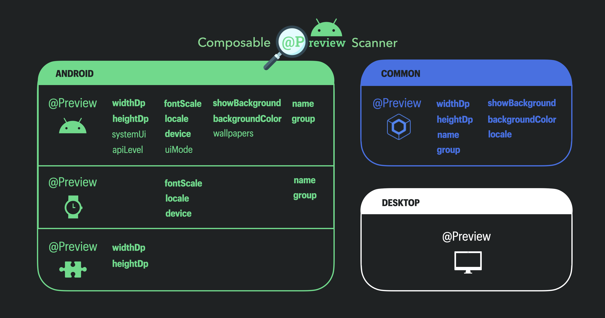

# Deprecated Modules


> [!WARNING]
> The `:common` and `:jvm` modules are deprecated and will be removed in version 0.10.0.
> Starting with Compose Multiplatform 1.10.0-beta02, Common and Desktop `@Preview` annotations are deprecated in favour of the Android `@Preview` annotation (`androidx.compose.ui.tooling.preview.Preview`), which can be used across `common` and `desktop` platforms as well.
> After migrating to these Android `@Preview`s, please migrate to using `AndroidComposablePreviewScanner` as described in the main [README.md](README.md).


### Common Previews (Deprecated)
You can find executable examples here:
- [Roborazzi](https://github.com/sergio-sastre/roborazzi/blob/droidcon/preview_tests/sample-generate-preview-common/src/androidUnitTest/kotlin/com/github/takahirom/preview/tests/CommonPreviewTest.kt)
- [Paparazzi](https://github.com/sergio-sastre/ComposablePreviewScanner/blob/master/tests/src/test/java/sergio/sastre/composable/preview/scanner/tests/paparazzi/PaparazziCommonComposablePreviewInvokeTests.kt)

And also [a video on how to set it with Roborazzi here](https://www.youtube.com/watch?v=zYsNXrf2-Lo&t=33m29s), and the [repo used in the video here](https://github.com/sergio-sastre/roborazzi/tree/droidcon/preview_tests).

Executable examples with Instrumentation-based screenshot testing libraries are coming soon.</br></br>

Since Compose Multiplatform 1.6.0, JetBrains has added support for `@Preview`s in `common`. ComposablePreviewScanner can also
scan such Previews when running on any jvm-target, like
- Android
- Desktop
- Jvm

ComposablePreviewScanner provides a `CommonComposablePreviewScanner` for that purpose.

Assuming that you have:
- some Compose Multiplatform `@Previews` defined in `common`
- some jvm-target module (i.e. Android or Desktop) where you want to run screenshot tests for those `@Previews`. That's because ComposablePreviewScanner only works in jvm-targets for now.

Here is how you could also run screenshot tests for those Compose Multiplatform `@Previews` together, for instance, with Roborazzi (would also work with Paparazzi or any Instrumentation-based library).

1. Add `:common` dependency for ComposablePreviewScanner:
```kotlin
// Maven Central
testImplementation("io.github.sergio-sastre.ComposablePreviewScanner:common:<version>")

// JitPack
testImplementation("com.github.sergio-sastre.ComposablePreviewScanner:common:<version>")
```
2. Add an additional Parameterized screenshot test for these Compose Multiplatform `@Previews`. This is basically the same as in the corresponding [Paparazzi](README.md#paparazzi), [Roborazzi](README.md#roborazzi), or [Instrumentation screenshot tests](README.md#instrumentation-screenshot-tests) sections, but use `CommonComposablePreviewScanner<CommonPreviewInfo>` and `CommonPreviewScreenshotIdBuilder`.
3. Run these screenshot tests by executing the corresponding command e.g. for android: `./gradlew yourModule:recordRoborazziDebug`

### Desktop Previews (Deprecated)
You can find [a video on how to set it with Roborazzi here](https://www.youtube.com/watch?v=zYsNXrf2-Lo&t=23m52s), and the [repo used in the video here](https://github.com/sergio-sastre/roborazzi/tree/droidcon/preview_tests).

As we've seen in the previous section [How it works](README.md#how-it-works), Compose-Desktop previews are still not visible to ClassGraph since they use `AnnotationRetention.SOURCE`.
There is [already an open issue](https://youtrack.jetbrains.com/issue/CMP-5675) to change it to `AnnotationRetention.BINARY`, which would allow ClassGraph to find them.

In the meanwhile, it is also possible to workaround this limitation with ComposablePreviewScanner as follows.

1. Add `:jvm` dependency from ComposablePreviewScanner 0.2.0+ and use Roborazzi:
```kotlin
// Maven Central
testImplementation("io.github.sergio-sastre.ComposablePreviewScanner:jvm:<version>")

// JitPack
testImplementation("com.github.sergio-sastre.ComposablePreviewScanner:jvm:<version>")
```

2. Configure Roborazzi as described [in the corresponding "Multiplatform support" section](https://github.com/takahirom/roborazzi?tab=readme-ov-file#multiplatform-support)

3. Define your own annotation. The only condition is not to define `AnnotationRetention.SOURCE`
   ```kotlin
   package my.package.path
      
   @Target(AnnotationTarget.FUNCTION)
   annotation class DesktopScreenshot
   ```
4. Annotate the Desktop Composables you want to generate screenshot tests for with this annotation, e.g.
```kotlin
    @DesktopScreenshot
    @Preview // It'd also work without this annotation
    @Composable
    fun MyDesktopComposable() { 
        // Composable code here
    }
```

5. Create the parameter provider for the Parameterized test. We can use [TestParameterInjector](https://github.com/google/TestParameterInjector) for that
```kotlin
class DesktopPreviewProvider : TestParameterValuesProvider() {
  @OptIn(RequiresShowStandardStreams::class)
  override fun provideValues(context: Context?): List<ComposablePreview<JvmAnnotationInfo>> =
    JvmAnnotationScanner("my.package.path.DesktopScreenshot")
      .enableScanningLogs()
      .scanPackageTrees("previews")
      .getPreviews()
}
```

6. Write the Parameterized test itself
```kotlin
fun screenshotNameFor(preview: ComposablePreview<JvmAnnotationInfo>): String =
   "$DEFAULT_ROBORAZZI_OUTPUT_DIR_PATH/${preview.declaringClass}.${preview.methodName}.png"

@RunWith(TestParameterInjector::class)
class DesktopPreviewTest(
   @TestParameter(valuesProvider = DesktopPreviewProvider::class)
   val preview: ComposablePreview<JvmAnnotationInfo>
) {
   @OptIn(ExperimentalTestApi::class)
   @Test
   fun test() {
      ROBORAZZI_DEBUG = true
      runDesktopComposeUiTest {
         setContent { preview() }
         onRoot().captureRoboImage(
            filePath = screenshotNameFor(preview),
         )
      }
   }
}
```

7. Run these Roborazzi tests by executing the corresponding command e.g. `./gradlew yourModule:recordRoborazziJvm` (if using the Kotlin Jvm Plugin)
